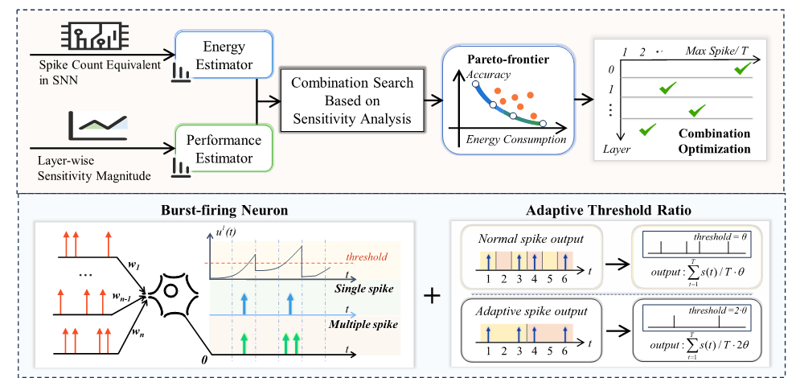

## Efficient and High-performance SNNs for Event-based Vision

### Abstract
Advancing event-driven vision through spiking neural networks (SNNs) is crucial to empowering high-speed and efficient perception. While directly converting the pre-trained artificial neural networks (ANNs) - by replacing the non-linear activation with spiking neurons - can provide SNNs with good performance, **the resultant SNNs typically demand long timesteps and high energy consumption to achieve their optimal performance**. To address this challenge, we **introduce the burst-spike mechanism** inspired by the biological nervous system, **allowing multiple spikes per timestep to reduce conversion errors and produce low-latency SNNs**. To further bolster this enhancement, we leverage the Pareto Frontier-driven algorithm to reallocate burst-firing patterns. Moreover, to reduce energy consumption during the conversion process, we propose a sensitivity-driven spike compression technique, which automatically locates the optimal threshold ratio according to layer-specific sensitivity. Extensive experiments demonstrate our approach outperforms state-of-the-art SNN methods, showcasing superior performance and reduced energy usage across classification and object detection.





### Running the Code

#### 1. Pre-training ANN on Neuromorphic Datasets:
```bash
python main_train_cifardvs.py --dataset cifar10dvs --arch resnet18
```
- `--dataset`: Specifies the dataset to be used, including `cifar10dvs, ncaltech101, ncars, action recognition`.

#### 2. SNN Calibration with Burst-Spike Technique:
```bash
python main_train_cifardvs.py --dataset cifar10dvs --arch resnet18 --T 8 --calib light --maxspike 4
```
- `--T`: timestep of SNN.
- `--calib`: calibration method, `light` as default .
- `--maxspike`: maximum number of burst-spikes.

#### 3. SNN Calibration with Burst-Spike Reallocation Technique:
```bash
python main_train_cifardvs.py --dataset cifar10dvs --arch resnet18 --T 8 --calib light \
--maxspike 4 --search --maxspike_ratio 1.0 --initialspike 8 --desired_spike 4 --minspike 1
```
- `--search`: Enables the search for optimal burst-spike reallocation.
- `--maxspike_ratio`: the factor ratio of energy budget.
- `--initialspike`: the initial number of burst-spike.
- `--desired_spike 4`: the target number of burst-spikes.
- `--minspike 1`: the minimum number of spikes allowed.

#### 4. SNN Calibration with Sensitivity Spike Compression Technique:
```bash
python main_train_cifardvs.py --dataset cifar10dvs --arch resnet18 --T 8 --calib light \
--maxspike 4 --search_threshold --threshold_ratio 1.0
```
- `--search_threshold`: Activates the search for the optimal threshold based on sensitivity.
- `--threshold_ratio 1.0`: the threshold ratio for spike compression.

